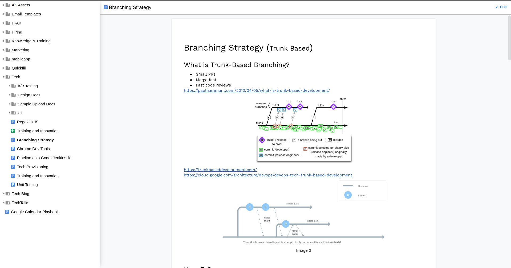
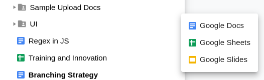
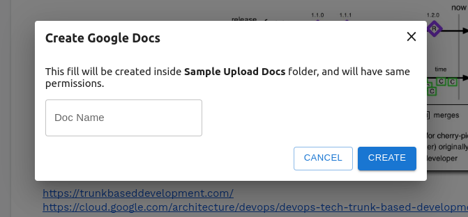
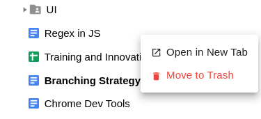

# GDocsWiki
As a small teams you can do documentation in Google Docs. But at 10-15 people, Google Drive becomes an unwieldy solution for housing internal documentation.

There are some other problems with GDocs (as suggested by people online)
1. Manually keep track of the documents URLs. 
2. Manage edit permissions via drive is a hassle.
3. Optimized for printed page (page-less is here, but has limitations)
4. By default in edit-mode if you have edit permission
5. No mechanism to dynamically embed content or especially lists of documents in another document
6. No friendly URLs for documents
7. Does not link documents nearly as easy as in a wiki (@ commands are here, will see if that solved this problem)
8. Does not support text zooming fully (appears to work, but try it, hit CTRL-+ and some document components often don't display properly. Basic documents work fine.)
9. No cross-document consistent styling
10. No visibility of related documents
11. By default created in root folder makes management difficult

With these points in mind, I wanted to create a solution to use GDocs, as wiki.
Take a look here:

## Features as of now
I am planning to do ad much heavy lifting by GDrive API as much as possible and to rely less and less on my server and custom DB. This will help keep the product free for most people, and will make transition easy for folks who don't wish to continue with this wiki.
Thinking to use browse storage as much as possible for faster navigation. And React Query to manage state and caching on client side.

### Sidebar to keep track of files and folders
This solves the problem of visibility of related docs [6, 9]

### Create documents on the fly in same folder
This solves the problem [10]

### By default opens in a simple view mode
This solves [4]

### Easy delete
By default google deletes document, and takes you to root, which seems too much destructive.

## Future Plans
As of now, it is not hosted anywhere, I am planning to find some time to host it for everyone use.
Add some features like:
### Already in plan
- Spaces
  - Can be done with GDrive API by creating shortcuts to other folders
  - Will be using google drive descriptions to create good descriptive contents
- Homepages for new employees to explore wiki
  - Thinking to showcase spaces
  - A well written description on how to navigate the wiki
- Better permissions view
  - Show something like "Shared with" in header, and single click action to give or revoke public access
- Page-less mode (will see if to use google page-less mode or create my own)
  - If page-less by google works, will use that
  - If not, will see to pick HTML from the document in web view
- Related files (thinking of using some kind of tag system)
  - Something like create tags first that you want to use
  - Then add tags to docs to find related files later across the drive
  - Store tags in custom properties, and search using them
- Tabs
  - This will work something like multi-sheets in spreadsheets
  - Single click open all related docs
- Sidebar
  -  Drag and Drop in sidebar to organize documents across folders
     - React beautiful DND
     - Drag from any folder to any folder that you can see in sidebar
     - Makes organization super fast
   - Show, hide, pin by default
   - Custom width
### Some ideas that I'll explore
These are just functionalities that I want to have, but don't have much idea how to go with it. Will explore in future.
- A way to use your own org OAuthCredentials. This will solve 2 problems
  - I don't have to worry about my API quota getting depleted
  - Your information will be more secure with your own org credentials.
  - I can create my Google App to ask for less permissions, as all permissions will be managed by your own OAuth Credentials.
- Friendly URLs
  - Will try to use some 3rd party if possible
  - OR try to find a way using gdrive api to store friendly URLs, and search using properties
- Dynamically add content
  - Will try to see if this can be picked if I go towards custom page-less mode
- Browser Extension (chrome and firefox)
  - Will create browser extension to edit the page content
  - This will open ways for functionality like:
    - Embedded documents
    - Drag from sidebar and drop to document to link documents together
- Search
  - By document name
  - Properties
  - By document content
- Better name for project
  - Google Wiki
  - YetAnotherWiki
  - YouDontNeedAWiki
  - WikiDocs

### Comparison with other solutions
[WIP] Will do comparison with YouNeedAWiki and kbee

### Conclusion
I am thinking if Google can pick this up as part of their roadmap, many businesses can benefit from it, and need of this project ends.

OR

Dreaming never hurts 💭 and they can approach me to acquire this solution at any stage to seamlessly integrate this with their suite.
